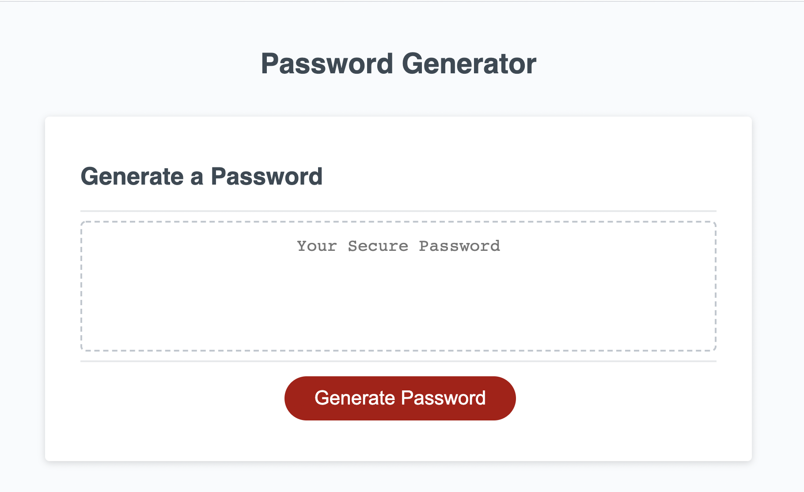
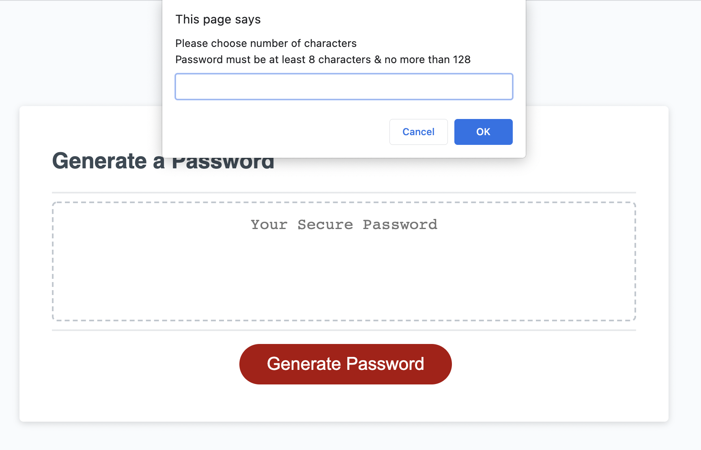
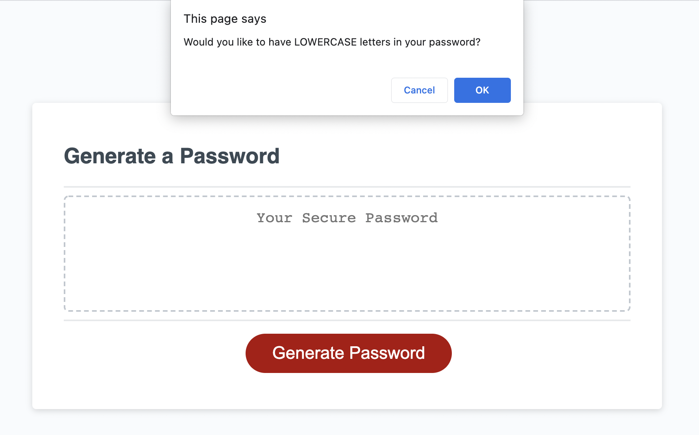
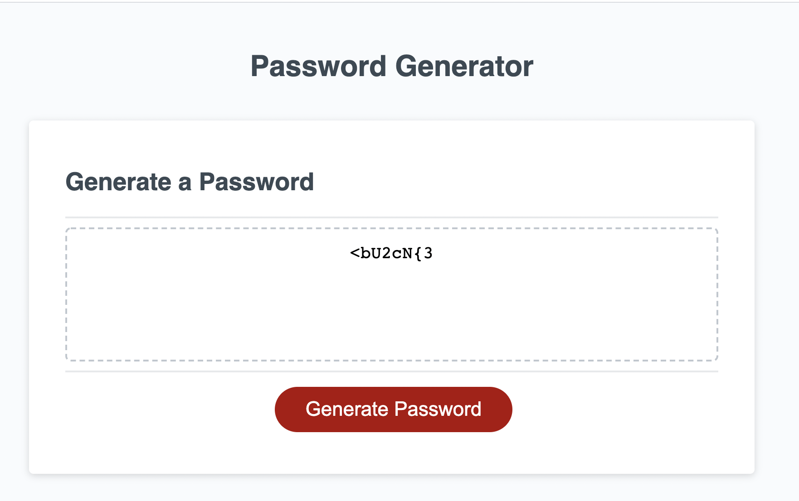

# random-password-generator

## Random Password Generator for User's with Access to Sensitive Data

This was a real challenge of my javascript knowledge & skills. It combined many complex layers of javascript functioning & was a great lesson on the importance of collaborating as a team. I tend to seek opportunities where I can thrive in an individual project, showing off my skills on what I can master on my own, without any help. This project however, absolutely humbled me & opened my eyes to the value that a team setting can offer. I am so grateful for how clearly my weaknesses were reflected through this assignment & my new-found respect for how others can really lift me up, rather than bring me down like I so readily want to believe. I had so much fun collaborating with fellow classmates & sharing ideas on how to debug & achieved desired results. There are so many ways to reach an outcome & it is so inspiring to watch how different minds work. 

The constant disappointment in receiving error messages in the console log & time & again seeing the code "fail" made that final moment when a random password was generated on my screen, perfectly meeting all my specified requirements, an ecstatic moment. The joy in seeing your project succeed after so much hard work & diligent effort is truly what makes this field so incredible. I can see how much coding is going to challenge me because I do not like to fail but what I am learning is that the true success is not giving up even when things aren't going to plan & desired outcomes aren't achieve immediately. I was able to hold onto my passion for coding even though it wasn't giving me what I wanted. I could see how the time wasn't wasted because every "fail" was a learning moment & one that is making me a stronger web developer. My aptitude for debugging & problem-solving has really been given a solid foundation with this application & will really enhance my future projects.

With my Random Password Generator, clients who have access to highly sensitive data are able to choose certain parameters the software can use to randomly generate a password they can use to protect their work. At a time when cyber security is constantly threatened, this Password Generator can give user's the security they desire, lowering the chances of hacked data.

The funtions this program uses are extremely beneficial for many applications on the web where the computer needs to respond to user input & generate information specific to them that they can use. This project will be a wonderful base for many of my other projects where javascript will be a key player in enhancing UI.

Technologies used : HTML5, Advanced CSS, Javascript

To access the deployed application, please click here : https://lyndseyjw.github.io/random-password-generator/

This project is licensed under the terms of the MIT license.

You may contact the sole contributor at lyndseyjwatson@gmail.com

I hope you enjoy!

 

